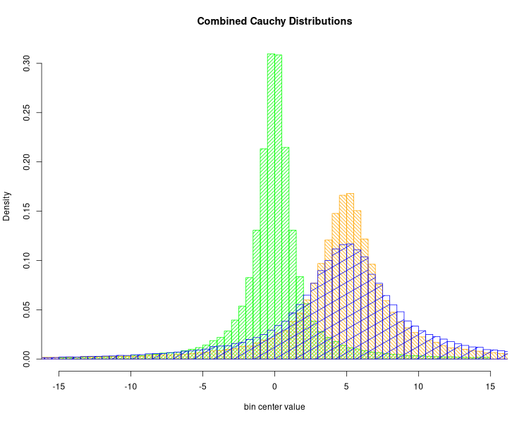
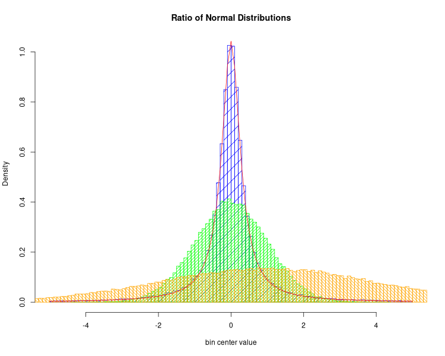
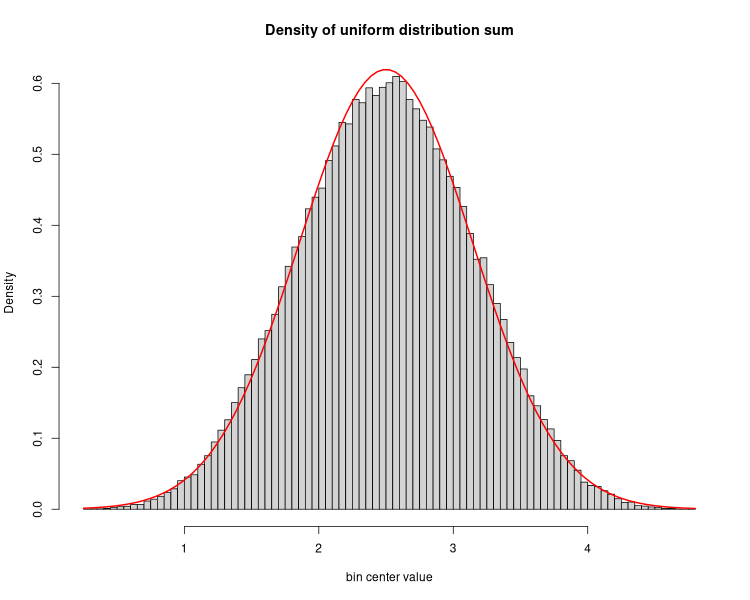

# Stable Distributions

Empiricially test a few weird assertions that show up in
the literature about probability distributions

## Linear Combinations of Normal Distributions

From the Wikipedia article on
[stable distributions](https://en.wikipedia.org/wiki/Stable_distribution):
> a distribution is said to be stable if a linear combination of two independent
> random variables with this distribution has the same distribution, up to
> location and scale parameters.

Wrote program [cacuhycombo.go](cacuhycombo.go) to try this out.
It creates two cauchy distributions with your choice of locaation and scale
prints them out, and prints out their sum.



## Ratio of Normal Distributions

From the Wikipedia article on
[stable distributions](https://en.wikipedia.org/wiki/Stable_distribution):
> When U and V are two independent normally distributed random variables
> with expected value 0 and variance 1,
> then the ratio U/V has the standard Cauchy distribution. 

Program [normalcombo.go](normalcombo.go) generates data for this one.
It creates two normal distributions with your choice of mean and standard deviation,
prints them out, and prints out not only their sum, but also their ratio.



## Sum of Uniform Distributions

From all over the place, we assertions that
the sum of normal distributions is a normal distribution.



## Build programs and make images

The old school tool `make` is perfect for this task.
Everything is file based, so `make` and its timestamp-based
directed acyclic graph of dependcies model works well

```
$ make
```

Beyond a Go compiler, you need the [R statistical and graphic language](https://www.r-project.org/about.html)
installed.
I used `R` to generate the histograms and probability distributions
in the illustrations for this README,
and to convince myself that the 3 assertions above are empirically correct.

I wrote and experimented with this on Arch Linux,
I expect it will be easy to re-compile under any modern Linux,
and probably any of the \*BSD operating systems.
It might be possible on modern MacOS.
Good luck with Windows, write when you get work!
